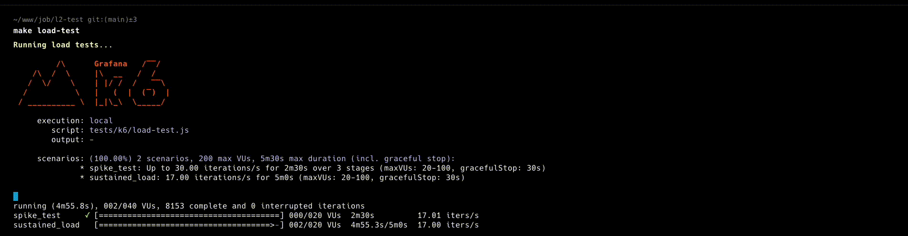
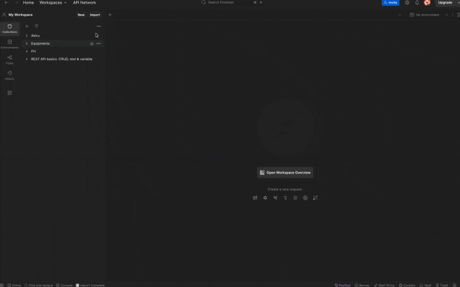

# High-Throughput Lead Management System

A pure API-based Symfony application for ingesting and managing lead data with high throughput capabilities. Built as a headless service that communicates exclusively through JSON responses.

## ⚙️ Requirements

- Docker
- Docker Compose
- Git
- k6 (for load testing)
- Postman (for API testing)

## 🚀 Quick Start

```bash
# Clone the repository
git clone https://github.com/Khrischatyy/l2-test.git
cd l2-test

# If you need a clean start (remove existing containers and volumes)
docker compose down -v
rm -rf vendor var

# Build and start the application
make build

# The build command will:
# 1. Start Docker containers
# 2. Install dependencies
# 3. Create database and run migrations
# 4. Create a test user
```

### Troubleshooting

If you encounter any issues:

1. Make sure no other services are using ports 8080 or 3306
2. Ensure Docker has enough resources allocated
3. If you get permission errors:
   ```bash
   sudo chown -R $(id -u):$(id -g) .
   ```
4. For cache issues:
   ```bash
   make clear-cache
   ```

## 🔑 Authentication

Default credentials for testing:
```
Email: test@example.com
Password: password123
```

After login, you'll receive a JWT token valid for 1 hour.

## 📡 API Endpoints

### Authentication
```http
POST /api/login_check
Content-Type: application/json

{
    "email": "test@example.com",
    "password": "password123"
}

Response:
{
    "token": "eyJ0eXAiOiJKV1QiLCJhbGciOiJSUzI1..."
}
```

### Lead Management
```http
# Create Lead
POST /api/leads
Authorization: Bearer <jwt_token>
Content-Type: application/json

{
    "firstName": "John",
    "lastName": "Doe",
    "email": "john@example.com",
    "phone": "+1234567890",
    "dateOfBirth": "1990-01-01",
    "additionalData": {
        "source": "website",
        "custom_field": "value"
    }
}

# List Leads
GET /api/leads?page=1&limit=10&sortBy=createdAt&sortOrder=DESC
Authorization: Bearer <jwt_token>
```

### Error Codes
```json
400 Bad Request
{
    "status": "error",
    "message": "Validation failed",
    "errors": {
        "email": ["This value is not a valid email address"],
        "phone": ["This value should match pattern: /^\\+?[1-9]\\d{1,14}$/"]
    }
}

401 Unauthorized
{
    "code": 401,
    "message": "JWT Token not found"
}

403 Forbidden
{
    "code": 403,
    "message": "Invalid JWT Token"
}

429 Too Many Requests
{
    "status": "error",
    "message": "Rate limit exceeded",
    "retry_after": 60
}
```

### Rate Limiting
- 1000 requests per minute per IP
- Headers returned:
  ```
  X-RateLimit-Limit: 1000
  X-RateLimit-Remaining: 999
  X-RateLimit-Reset: 60
  ```

## 🔍 Monitoring

```bash
make api-logs          # Last 10 requests
make api-logs-errors   # Error logs
make api-request-data  # Full request/response data
```

## 🚀 Performance Testing



### Test Results
```
█ THRESHOLDS 
  ✓ errors: rate<0.1 (0.00%)
  ✓ http_req_duration: p(95)<2000ms (actual: 25.42ms)

█ METRICS
  ✓ Requests/second: 54.79/s
  ✓ Average response time: 18.3ms
  ✓ Success rate: 100%
```

### Running Tests
```bash
make load-test           # Run complete test suite
make load-test-sustained # Test steady load
make load-test-spike    # Test traffic spikes
```

## 📈 Scaling Recommendations

### Application Level
- Enable OPcache in production
- Use APCu for application caching
- Configure PHP-FPM process manager:
  ```ini
  pm = dynamic
  pm.max_children = 50
  pm.start_servers = 5
  pm.min_spare_servers = 5
  pm.max_spare_servers = 35
  ```

### Database
- Master-Slave replication for read scaling
- Partitioning leads table by date
- Index optimization:
  ```sql
  CREATE INDEX idx_leads_created_at ON leads (created_at);
  CREATE INDEX idx_leads_email ON leads (email);
  ```

### Caching
- Redis cluster for horizontal scaling
- Cache invalidation strategy:
  ```php
  Cache-Control: public, max-age=3600
  Etag: "hash_of_content"
  ```

### Load Balancing
- Nginx with upstream configuration
- Session affinity for JWT tokens
- Health checks:
  ```nginx
  health_check interval=5s fails=3;
  ```

### Monitoring
- Prometheus metrics
- Grafana dashboards
- Alert thresholds:
  - Response time > 500ms
  - Error rate > 1%
  - CPU load > 80%

## 📡 API Documentation

### Using Postman



A complete Postman collection is available at `postman/Lead Management API.postman_collection.json` with:
- Pre-configured environments
- Automatic JWT token handling
- Example requests for all endpoints
- Response validation examples

To use the collection:
1. Import `postman/Lead Management API.postman_collection.json` into Postman
2. Set up environment variables:
   - `baseUrl`: `http://localhost:8080`
   - `token`: Will be automatically set after login