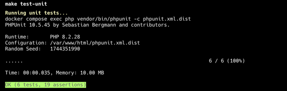

# High-Throughput Lead Management System

A pure API-based Symfony application for ingesting and managing lead data with high throughput capabilities. Built as a headless service that communicates exclusively through JSON responses.

## ⚙️ Requirements

- Docker
- Docker Compose
- Git
- k6 (for load testing)
- Postman (for API testing)

## 🚀 Quick Start

```bash
# Clone the repository
git clone https://github.com/Khrischatyy/l2-test.git
cd l2-test

# If you need a clean start (remove existing containers and volumes)
docker compose down -v
rm -rf vendor var

# Build and start the application
make build

# The build command will:
# 1. Start Docker containers
# 2. Install dependencies
# 3. Create database and run migrations
# 4. Create a test user
```


### Troubleshooting

If you encounter any issues:

1. Make sure no other services are using ports 8080 or 3306
2. Ensure Docker has enough resources allocated
3. If you get permission errors:
   ```bash
   sudo chown -R $(id -u):$(id -g) .
   ```
4. For cache issues:
   ```bash
   make clear-cache
   ```

### Using Postman


A complete Postman collection is available at `postman/Lead Management API.postman_collection.json` with:
- Pre-configured environments
- Automatic JWT token handling
- Example requests for all endpoints
- Response validation examples

To use the collection:
1. Import `postman/Lead Management API.postman_collection.json` into Postman
2. Set up environment variables:
    - `baseUrl`: `http://localhost:8080`
    - `token`: Will be automatically set after login

## 🔑 Authentication

Default credentials for testing:
```
Email: test@example.com
Password: password123
```

After login, you'll receive a JWT token valid for 1 hour.

## 📡 API Endpoints

### Authentication

#### Login
```http
POST /api/login_check
Content-Type: application/json

{
    "email": "test@example.com",
    "password": "password123"
}
```

**Response (Success)**
```json
{
    "token": "eyJ0eXAiOiJKV1QiLCJhbGciOiJSUzI1..."
}
```

**Response (Error)**
```json
{
    "status": "error",
    "code": 401,
    "message": "Invalid credentials",
    "errors": {}
}
```

### Lead Management

#### Create Lead
```http
POST /api/leads
Authorization: Bearer <jwt_token>
Content-Type: application/json

{
    "firstName": "John",
    "lastName": "Doe",
    "email": "john@example.com",
    "phone": "+1234567890",
    "dateOfBirth": "1990-01-01",
    "additionalData": {
        "source": "website",
        "custom_field": "value"
    }
}
```

**Response (Success)**
```json
{
    "status": "success",
    "code": 201,
    "message": "Lead created successfully",
    "data": {
        "id": 1,
        "firstName": "John",
        "lastName": "Doe",
        "email": "john@example.com",
        "createdAt": "2024-03-20T10:00:00+00:00"
    }
}
```

#### List Leads
```http
GET /api/leads?page=1&limit=10&sortBy=createdAt&sortOrder=DESC
Authorization: Bearer <jwt_token>
```

**Response (Success)**
```json
{
    "status": "success",
    "code": 200,
    "message": "Leads retrieved successfully",
    "data": {
        "items": [
            {
                "id": 1,
                "firstName": "John",
                "lastName": "Doe",
                "email": "john@example.com",
                "createdAt": "2024-03-20T10:00:00+00:00"
            }
        ],
        "pagination": {
            "total": 100,
            "page": 1,
            "limit": 10,
            "pages": 10
        }
    }
}
```

**Query Parameters**
| Parameter | Type   | Description                    | Default |
|-----------|--------|--------------------------------|---------|
| page      | int    | Page number                    | 1       |
| limit     | int    | Items per page                 | 10      |
| sortBy    | string | Field to sort by               | createdAt|
| sortOrder | string | Sort direction (ASC/DESC)      | DESC    |

### Error Responses

All error responses follow a consistent format:

```json
{
    "status": "error",
    "code": <http_status_code>,
    "message": "<error_message>",
    "errors": {
        "<field>": ["<error_detail>"]
    }
}
```

Common error scenarios:

```json
# 400 Bad Request (Validation Error)
{
    "status": "error",
    "code": 400,
    "message": "Validation failed",
    "errors": {
        "email": ["This value is not a valid email address"],
        "phone": ["This value should match pattern: /^\\+?[1-9]\\d{1,14}$/"]
    }
}

# 401 Unauthorized
{
    "status": "error",
    "code": 401,
    "message": "JWT Token not found",
    "errors": {}
}

# 403 Forbidden
{
    "status": "error",
    "code": 403,
    "message": "Invalid JWT Token",
    "errors": {}
}

# 409 Conflict (Duplicate Lead)
{
    "status": "error",
    "code": 409,
    "message": "Duplicate lead detected",
    "errors": {
        "email": ["A lead with this email already exists"]
    }
}

# 429 Too Many Requests
{
    "status": "error",
    "code": 429,
    "message": "Rate limit exceeded",
    "errors": {
        "retry_after": 60
    }
}

# 500 Internal Server Error
{
    "status": "error",
    "code": 500,
    "message": "An error occurred while processing the request",
    "errors": {}
}
```

### Development Environment Debug Information

In development environment, error responses may include additional debug information:

```json
{
    "status": "error",
    "code": 500,
    "message": "An error occurred while processing the request",
    "errors": {},
    "debug": {
        "exception": "App\\Exception\\DatabaseException",
        "message": "Database connection failed",
        "file": "/app/src/Service/LeadService.php",
        "line": 42
    }
}
```

## 🔍 Monitoring

```bash
make api-logs          # Last 10 requests
make api-logs-errors   # Error logs
make api-request-data  # Full request/response data
```

## 🚀 Performance Testing


### Test Results
```
█ THRESHOLDS 
  ✓ errors: rate<0.1 (0.00%)
  ✓ http_req_duration: p(95)<2000ms (actual: 25.42ms)

█ METRICS
  ✓ Requests/second: 54.79/s
  ✓ Average response time: 18.3ms
  ✓ Success rate: 100%
```

### Running Tests
```bash
make load-test           # Run complete test suite
make load-test-sustained # Test steady load
make load-test-spike    # Test traffic spikes
```

## 📈 Scaling Recommendations

### Application Level
- Enable OPcache in production
- Use APCu for application caching
- Configure PHP-FPM process manager:
  ```ini
  pm = dynamic
  pm.max_children = 50
  pm.start_servers = 5
  pm.min_spare_servers = 5
  pm.max_spare_servers = 35
  ```

### Database
- Master-Slave replication for read scaling
- Partitioning leads table by date
- Index optimization:
  ```sql
  CREATE INDEX idx_leads_created_at ON leads (created_at);
  CREATE INDEX idx_leads_email ON leads (email);
  ```

### Caching
- Redis cluster for horizontal scaling
- Cache invalidation strategy:
  ```php
  Cache-Control: public, max-age=3600
  Etag: "hash_of_content"
  ```

### Load Balancing
- Nginx with upstream configuration
- Session affinity for JWT tokens
- Health checks:
  ```nginx
  health_check interval=5s fails=3;
  ```

### Monitoring
- Prometheus metrics
- Grafana dashboards
- Alert thresholds:
  - Response time > 500ms
  - Error rate > 1%
  - CPU load > 80%

### Architecture
- Implement database replication and failover:
  - Master-Slave setup with automatic failover
  - Read replicas for scaling read operations
  - Regular backups with point-in-time recovery
- Consider microservices approach:
  - Separate write and read services
  - Event-driven architecture for better scalability
  - Message queues for async processing
- High availability setup:
  - Multiple availability zones
  - Load balancers with health checks
  - Circuit breakers for service resilience

## 📡 API Documentation


## Testing

### Unit Tests

The application includes a comprehensive suite of unit tests to ensure code quality and reliability. Tests are organized in the `tests/` directory following the same structure as the source code.

#### Running Tests

To run the unit tests:

```bash
make test-unit
```

This will execute all unit tests in the project. The test suite includes:

- Entity tests (e.g., `LeadTest`)
- Command tests (e.g., `CreateUserCommandTest`)
- API request/response tests

#### Test Structure

- `tests/Entity/` - Tests for Doctrine entities
- `tests/Command/` - Tests for Symfony console commands
- `tests/Constants/` - Test constants used across tests

#### Test Configuration

The project uses PHPUnit for testing with the following configuration:
- Test environment: `APP_ENV=test`
- Code coverage reporting enabled
- Strict testing mode enabled
- Random test execution order

#### Test Results


